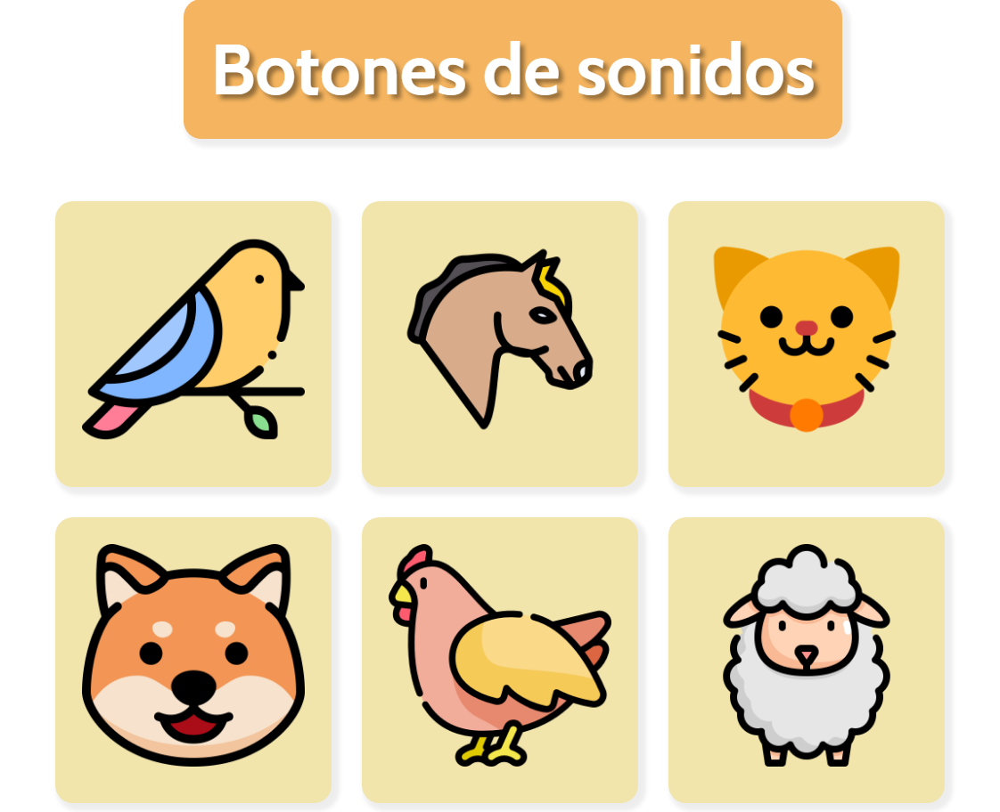

# **Botones de sonidos de Animales para Niños**

¡Bienvenido al proyecto de **Sonidos de Animales**! 🎵🐶🐱 Este es un proyecto interactivo que utiliza HTML, CSS y JavaScript para enseñar a los niños sobre diferentes animales a través de botones que reproducen sus sonidos y poder identificarlos.

## **Descripción**

Este proyecto presenta seis botones, cada uno asociado con el sonido de un animal diferente. Los niños pueden hacer clic en los botones para escuchar los sonidos característicos de esos animales, lo que ayuda a hacer el aprendizaje divertido y educativo.

### **Características**

- **Seis Botones Interactivos**: Cada botón representa un animal diferente y reproduce su sonido al hacer clic.
- **Diseño Colorido y Atractivo**: El diseño está optimizado para ser visualmente atractivo para los niños.
- **Fácil de Usar**: La interfaz es simple y accesible, ideal para los más pequeños.

## **Tecnologías Utilizadas**

- **HTML**: Para la estructura de la página web.
- **CSS**: Para el diseño y la apariencia visual de los botones y la página.
- **JavaScript**: Para la funcionalidad interactiva de los botones, incluyendo la reproducción de los sonidos.

## **Cómo Funciona**

1. **Estructura**: La página web está construida con HTML, donde cada botón está asociado con un archivo de sonido específico.
2. **Estilo**: El CSS se encarga de estilizar los botones y la página, haciendo que sean llamativos y fáciles de interactuar.
3. **Interactividad**: El JavaScript se encarga de manejar los eventos de clic en los botones y reproducir el sonido correspondiente.

## **Demostración**

Aquí hay una captura de pantalla de cómo se ve la página:

